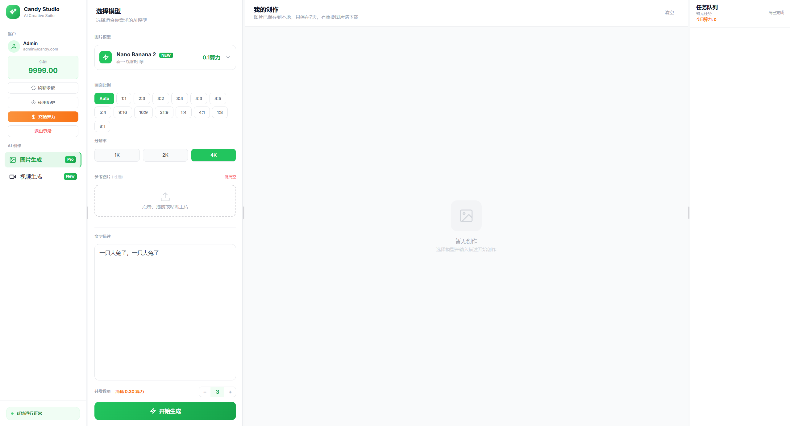
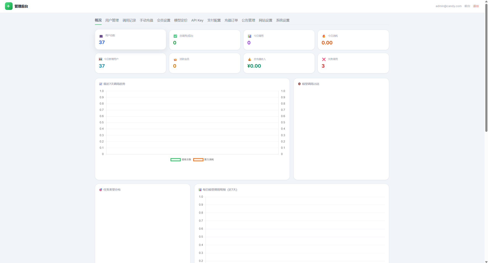
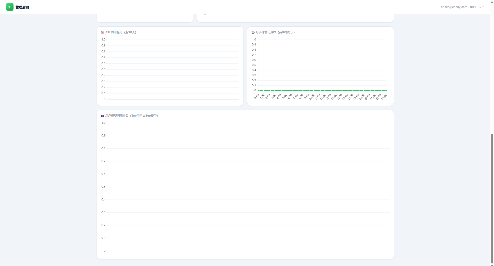
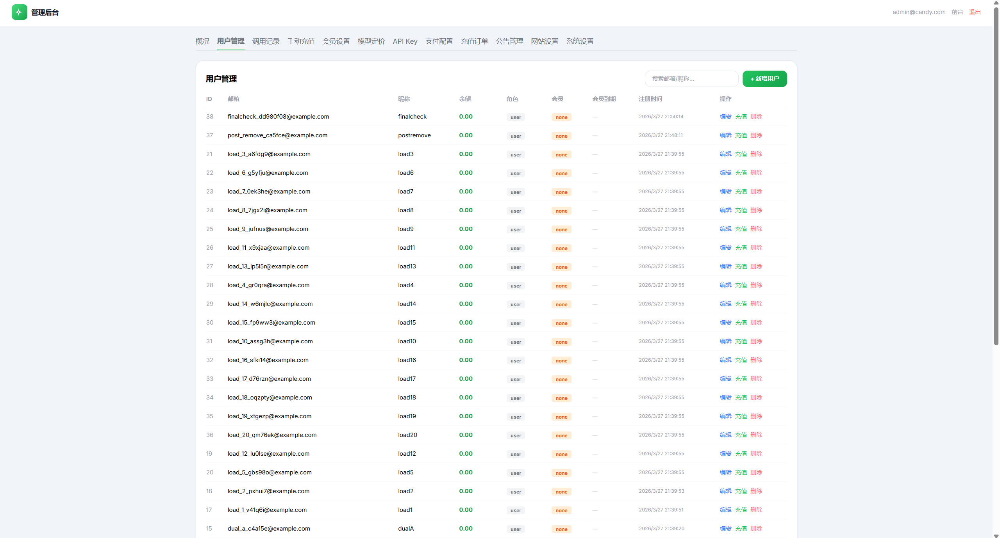
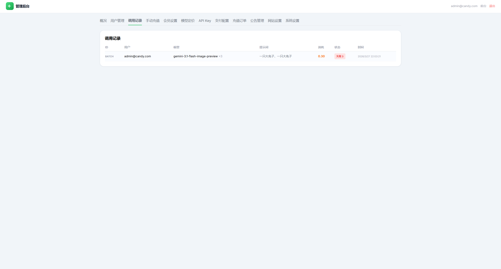
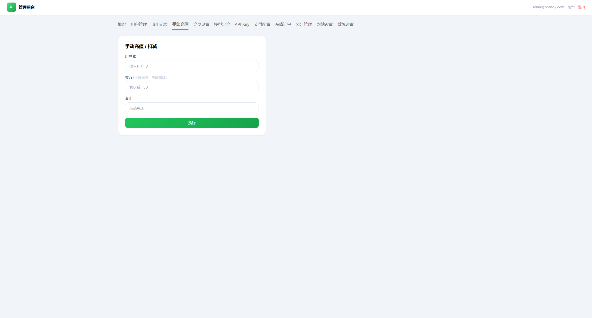
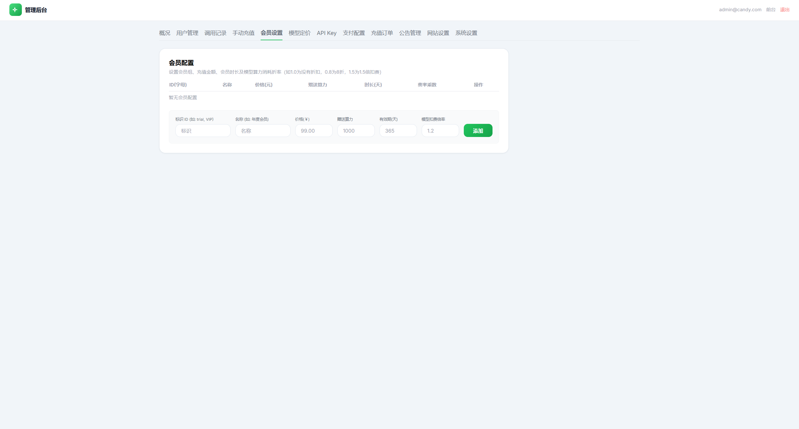
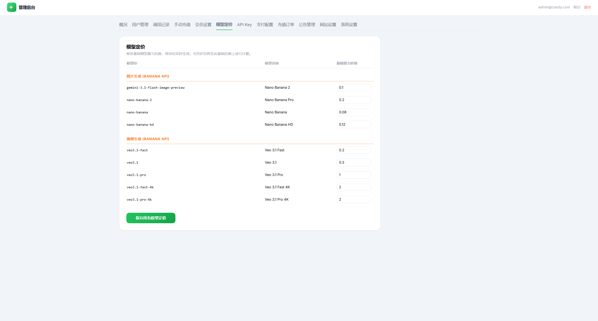

# Candy Studio

[English README](./README.en.md)

[](./LICENSE)


> 面向个人站长与小团队的 Banana Pro / Banana 2 AI 图片与视频分发站  
> 从上游中转拿货，到下游网站零售，一套可直接落地的差价运营底座

Candy Studio 是一个面向个人站长和小团队的开源 AI 图片与视频生成网站。
它适合这样一种实际运营模式：从上游中转 API 或模型供应渠道拿货，再通过你自己的品牌网站把生成能力分发给终端用户。

换句话说，这个项目很适合用来搭建一个个人可运转的 Banana Pro / Banana 2 模型售卖与出图网站：

- 接入上游中转 API 或供货渠道
- 向自己的客户提供图片和视频生成服务
- 管理账户、余额、会员、充值和后台配置
- 通过定价差、套餐差和会员策略赚取利润

## 项目预览

### 前台工作台



### 后台管理









## 项目定位

Candy Studio 不是一个只适合演示的前端页面，而是一套可以直接拿来改造和运营的 AI 创作分发系统。
它关注的是一条完整的业务链路：

`接入上游能力 -> 封装成自己的站点 -> 给客户提供生成服务 -> 用价格差完成变现`

这个仓库尤其适合：

- 个人或小团队 AI 工具运营
- Banana Pro、Banana 2 及相关模型分发场景
- 基于中转 API 的图片站、视频站、出图站
- 私有部署给社群、客户群体或垂直创作者群体

## 适合谁使用

如果你属于下面这些类型，这个项目会非常合适：

- 想搭建自己的 AI 出图站、视频站，而不想从零开始写后台和账户系统的人
- 已经有上游中转 API、模型供货渠道，想做自有品牌分发和零售的人
- 想做 Banana Pro / Banana 2 模型售卖、会员订阅、积分充值的人
- 想快速测试 AI 工具商业化闭环，验证“拿货 -> 分发 -> 变现”模式的人
- 想面向社群、客户群、工作室或垂直行业部署私有 AI 生成网站的人

## 核心能力

- 用户注册与登录
- 基于 JWT 的鉴权体系
- 后台管理面板
- 图片与视频生成工作流
- 积分、充值、会员体系
- MySQL 数据存储
- 上游 API Key 轮换与基础地址配置

## 商业使用方式

这套项目的典型商业模式是：

1. 你从上游中转站或 API 供应商获取生成能力。
2. 你在后台配置自己的模型成本、零售价和会员套餐。
3. 用户在你的网站上生成 Banana 风格图片或视频。
4. 平台自动记录调用、扣除积分，并支持充值。
5. 你的利润来自上游拿货成本与下游零售价格之间的差价。

所以它特别适合想快速启动轻量 AI 生成业务的人，不需要从零再去搭建账户系统、后台、充值和调用分发系统。

## 技术栈

- 前端：HTML、Tailwind CDN、Vanilla JavaScript
- 后端：Node.js、Express
- 数据库：MySQL 8+
- 鉴权：JWT + bcrypt

## 目录结构

```text
.
|-- backend/
|   |-- sql/
|   |-- src/
|   |-- .env.example
|   `-- package.json
|-- js/
|-- admin.html
|-- index.html
|-- main.js
|-- package.json
`-- README.md
```

## 快速开始

### 1. 创建数据库

```sql
CREATE DATABASE candy_studio CHARACTER SET utf8mb4 COLLATE utf8mb4_unicode_ci;
```

### 2. 创建本地环境文件

```powershell
Copy-Item backend\.env.example backend\.env
```

然后在 `backend/.env` 中填写你自己的真实配置，至少包括：

- `DATABASE_URL`
- `JWT_SECRET`
- `BANANA_API_KEY`
- `BANANA_API_BASE`
- `ADMIN_EMAIL`
- `ADMIN_PASSWORD`
- `ADMIN_PATH`
- `ADMIN_ACCESS_CODE`

### 3. 安装后端依赖

```powershell
cd backend
npm install
```

### 4. 启动网站

```powershell
npm start
```

## 本地访问地址

- 前台：`http://localhost:3001/`
- 健康检查：`http://localhost:3001/api/health`
- 后台：`http://localhost:3001/{ADMIN_PATH}?code={ADMIN_ACCESS_CODE}`

## 开源说明

这个仓库开源的目的，是让独立运营者能够更快搭建、改造和部署自己的 AI 生成网站。

仓库包含：

- 完整的网站代码
- 账户体系与后台流程
- 定价、积分、会员逻辑
- 基于 MySQL 的运行时能力
- 可直接二次开发的 AI 分发业务底座

仓库不包含：

- 你的私有上游 API Key
- 你的生产数据库
- 你的本地后台密码
- 任何关于盈利、合规或上游稳定性的承诺

在公开部署前，建议你自行评估和修改：

- 你的定价策略
- 上游 API 的服务条款
- 内容审核与风控策略
- 支付流程
- 你所在地区的法律与合规要求

## 免责声明与风险提示

- 本项目仅提供技术实现与开源代码，不对任何实际经营结果、收益结果或商业回报作出承诺。
- 你需要自行确认所接入上游 API、模型服务和中转渠道的可用性、稳定性与服务条款。
- 你需要自行承担公开运营网站后的内容审核、风控、支付、合规和用户管理责任。
- 若你将本项目用于商业用途，请先确认你所在地区对于 AI 内容生成、支付收款、用户数据存储等方面的法律要求。
- 本项目默认不附带任何生产密钥、生产数据库或真实运营配置，部署前请自行完成安全配置和权限隔离。

## 部署说明

- 数据表会在启动时自动初始化。
- 如果管理员账户不存在，系统会根据 `.env` 里的配置自动创建。
- 仓库里提交的 `.env` 内容是占位值，运行前请替换成你自己的真实配置。
- `.env` 和日志文件已经被忽略，不应提交到公开仓库。
- 根目录还保留了一个可选的 Electron 包装层，但网站部署本身并不依赖它。

## License

MIT
